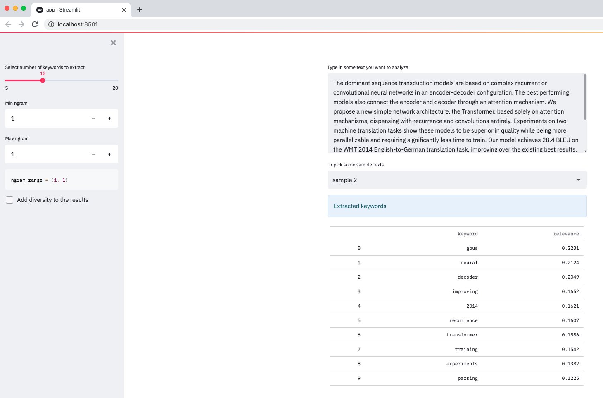

# How to extract meaningful and semantic keywords using BERT and Streamlit

This small Streamlit app uses **KeyBert** to extract meaningful keywords from text documents.

KeyBert can be an alternative to bag of words techniques (e.g. Count or Tfidf vectorizers) that might suffer from noisy results.

You can try it out by:

- pasting a text or picking a sample
- selecting the top n keywords to extract
- specifying the `keyphrase_ngram_range`
- adding diversity in the results by using Max Sum Similarity or Maximal Marginal Relevance

---



### Run the app locally

```sh
pip install pipenv
cd keywords-extractor-with-bert

pipenv install
pipenv shell
streamlit run app.py
```

### Credits

- [KeyBert](https://github.com/MaartenGr/KeyBERT)
